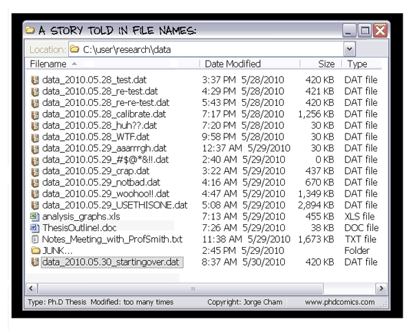

.. EPICON documentation master file, created by
   sphinx-quickstart on Thu Feb  9 14:30:39 2017.
   You can adapt this file completely to your liking, but it should at least
   contain the root `toctree` directive.

=================================================
How to organize a computational (biology) project
=================================================

.. contents::

You just joined the lab and you are wondering how best to organize yourself!
Or you are just getting started on the computational aspect of your project,
and would like to start with all of the best practices.

Here are recommendations, references, and general guidelines.

First, take a quick look at `A quick guide to organize your computational
biology project
<https://journals.plos.org/ploscompbiol/article?id=10.1371/journal.pcbi.1000424>`_.
While a bit outdated, this paper contains all the core concepts we will
discuss here.

1. Organizing your code!
========================

Think about how to organize your code. I recommend a structure close to
the one proposed in the ``quick guide to organize your computation biology
project``::

  my_awesome_project/
    - data/
        - ay2009
        - …
    - scripts/
        - data_cleaning
        - normalization
        - statistical_analysis
        - …
    - bin/
        - my_awesome_package
        - …
    - results/
        - notebook.html
    - doc
        - paper
        - 2020_labmeeting
        - …

1. `data` contains the raw data of your project. Ideally, create a small
   script to automatically download the data.

2. `scripts` contains a series of folders, each corresponding to a step in the
   data analysis process. In those folders, add all scripts necessary to this
   step. That includes visualization. A concrete example: working on Hi-C
   data, the first step is always to normalize the data. I thus create a
   folder `normalization` in `scripts`. In it, I add a script called
   `normalize_counts.py` and another one called `plot_contact_counts.py`. The
   first is the script I use to normalize the data. The second is a script I
   use to visualize the raw or the normalize contact counts: it outputs a png
   file for each of my datasets which I can then add to my labnotebook (more
   below).

3. `bin` contains any package you may be developping for this particular
   project. It can also be empty if you don't develop anything.

4. `results` contains the labnotebook. This notebook should either by an html
   file or something that can be compiled in an HTML file so that it is easily
   shareable with collaborators.

5. `doc` contains any communication document you may be creating relating to
   this project.

By using this fairly standard code organization, anyone will be able to look
at your project and understand where to find elements.

2. Using Version Control
========================

As soon as you have code, you should be using a version control system to
track changes you make to it. It also allows you to have a backup of your code
on a server somewhere. Version control system allows you to take snapshots of
your code at any moment you want.

There are different tools to perform this. These days, the two most common one
are `git` and `mercurial`. I personally recommend using `git`, as it is the
one supported by the platform `GitHub` on which TrEE has an academic
organization (reach out to Nelle or Sophie to get access to our academic
organization `https://github.com/TrEE-TIMC <https://github.com/TrEE-TIMC>`_) 

Tips and tricks with git
-------------------------

- There are many publicly available resources to us git: https://git-scm.com/docs/gittutorial
- *Start simple* get familiar with `git add`, `git commit` and `git push`
  before moving on to more advanced command.
- If you plan on contributing to an open-source project, you need to be
  familiar with the concept of **branching**.

3. The electronic labnotebook
=============================

Keep track of all and any experiment your run, whether it fails or not! Do
this in an electronic labnotebook, so that you can easily share it with
collaborators. This is particularly useful if you are working remotely and/or
have video confcall meeting regurlarly.

Tips and tricks with maintaining an electronic labnotebook
-----------------------------------------------------------

- I use `sphinx <http://www.sphinx-doc.org/en/stable/>`_, the tool used to
  write documentation in Python to maintain my electronic labnotebooks.
- Try to write something everyday.
- You can ask our IT team to give you access to `lacan` via ssh and create a
  TIMC HTML members's page to host the html files and share it with your
  collaborators. This page can be password protected through
  `.htpasswd`/`.htaccess` system, but you need to reach out to IT in order to
  activate this.

4. Automating your code
=======================

Make sure you can rerun your analysis from scratch with a single or very few
commands!

I use makefiles in order to do this, but creating a large bash file would work
as well. You can also add all your code in a jupyter notebook or Rmd file, but
beware that jupyter notebooks don't play well with version control. They are
also not ideal for code reusability.

You can also set up `travis <travis-ci.org/>`_ in order to rerun your whole
computational pipeline from scratch every time you push to github.
